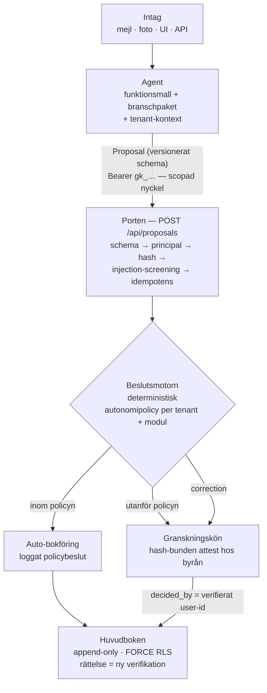

# grundbok

**Agentdriven bokföring för svenska byråer — varje bokföringsbeslut går genom ett granskbart förslagskontrakt.**

[](https://github.com/leopold-jpg/grundbok/actions/workflows/ci.yml)
[](./LICENSE)
[](https://nextjs.org)

Specialistagenter tolkar underlag och föreslår konteringar enligt gällande rätt;
människan attesterar avvikelserna, och andelen avvikelser sjunker över tid via
policy. Ingen rad når huvudboken utan att en behörig människa attesterat den
eller att kundens egen autonomipolicy uttryckligen tillåtit det — gaten är
arkitektur, inte en checkbox. Allt spårbart, hash-bundet och AI Act-redo.

## Arkitekturen i en bild



Enda skrivvägen till huvudboken är förslagskontraktet ([ADR-0002](./docs/adr/0002-forslagskontrakt-och-agentgrans.md)):
agenter — även externa, OpenClaw-körda — är klienter med scopade nycklar som kan
föreslå men aldrig bokföra. Varje förslag bär modell, promptversion, konfidens
och lagrum, så AI Act-dokumentationen genereras som biprodukt.

## Agentfabriken

En agent är inte en maskin utan **en rad i databasen** ([ADR-0003](./docs/adr/0003-serverless-multitenant-runtime.md)):
provisionering är en insert, pausning en statusändring (porten svarar 403),
nyckelrotation ett enda flöde. Agentkoden deployas en gång som stateless
workers och servar alla tenants; jobb flödar genom en kö med pgmq-semantik
och per-tenant concurrency-tak.

Vad en agent *är* bestäms av mallkatalogen — fast, versionerad kod i repot,
aldrig fritext per agent ([ADR-0004](./docs/adr/0004-fast-mallkatalog-och-agenttelemetri.md)):

- **Funktionsroller** ([ADR-0005](./docs/adr/0005-funktionsmallar-med-branschpaket.md)):
  `bokforing`, `lon`, `skatt-compliance`, `leverantorsreskontra`. Kärnkompetensen
  (mottagarkontroll, förskott, omvänd moms, kvittomatchning, dubblettdetektering)
  är branschoberoende och skrivs en gång.
- **Branschpaket**: fristående regelpaket (omvänd byggmoms, ROT, kassarapporter …)
  som aktiveras via tenant-kontexten. Ny bransch = ett paket, inte fyra nya mallar.
- **En agent = funktionsmall + tenantens branschpaket + tenantens historik.**
  Kundunikhet bor i tenant-kontexten och autonomipolicyn, aldrig i mallen.
- **Telemetri** härleds ur proposals-datat via vy — aldrig räknare på agentraden —
  så hela flottan kan överblickas i operatörskonsolen.

## Teknikstack

| Lager | Val |
|---|---|
| Webb & API | Next.js 16 (App Router) · React 19 · TypeScript |
| Kontrakt & validering | Zod-schemat `Proposal` + kanonisk SHA-256-hash |
| Databas | PGlite lokalt, Supabase (Postgres) vid deploy — append-only-triggers, FORCE ROW LEVEL SECURITY |
| Auth | `AuthAdapter`-interface: lokal PGlite-auth i dev, Supabase Auth i prod som adapterswap |
| AI | Anthropic API (claude-opus-4-8, structured output) — med deterministisk fallback med exakt samma schema, så hela kedjan kör utan nyckel och nät |
| Tester | Nodes inbyggda testrunner (183 tester) + `scripts/e2e.py` över HTTP |

## Status per etapp

| Etapp | Status |
|---|---|
| Kärnan — kontrakt, beslutsmotor, append-only-ledger, RLS | ✅ klar |
| Ytor & auth — publik sajt, `/byra`, `/operator`, rollmodell | ✅ klar |
| Design — designsystem + publika sajtens design-pass | ✅ klar |
| Mallkatalog & agentfabrik — funktionsroller, branschpaket, provisionering, telemetri | ✅ klar |
| Innehåll — mallarnas och paketens sakinnehåll | 🔨 pågår |
| Intag — mejl per byrå, foto/upload, `/api/intake`, kundappen | ⬜ kvar |
| Deploy — Supabase-moln, Vercel, domän | ⬜ kvar *(provisionerat, kabeldragning återstår)* |

## Kom igång

```bash
npm install
cp .env.example .env.local   # valfritt: ANTHROPIC_API_KEY för live-AI
npm run dev                  # → http://localhost:3456
npm test                     # 183 tester: kontrakt, beslutsmotor, RLS, auth, ytor, fabrik
```

Utan API-nyckel körs den deterministiska fallbacken — samma schema, samma
flöde; intaget visar alltid vilken motor som tolkade underlaget.

## Läs vidare

- **[docs/GRUNDBOK-MASTERPLAN.md](./docs/GRUNDBOK-MASTERPLAN.md)** — kartan: ytorna, lagren, roadmapen
- **[docs/ARKITEKTUR.md](./docs/ARKITEKTUR.md)** — teknisk översikt för nya utvecklare
- **[docs/adr/](./docs/adr/README.md)** — arkitekturbesluten, ett dokument per beslut
- **[ULTRAPLAN.md](./ULTRAPLAN.md)** — tesen och grundarkitekturen

## Licens

MIT idag — se [LICENSE](./LICENSE). Licensfrågan är under övervägande och kan
komma att ändras inför kommersialisering.
